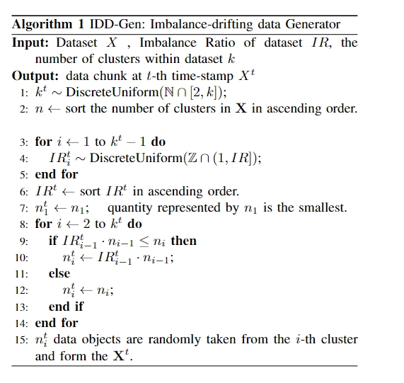
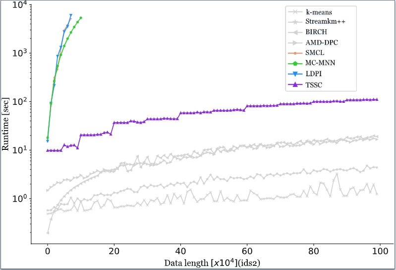
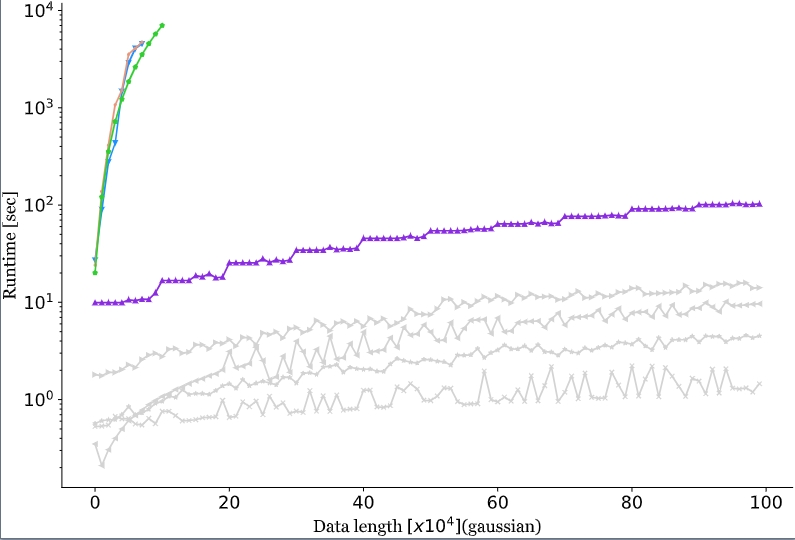
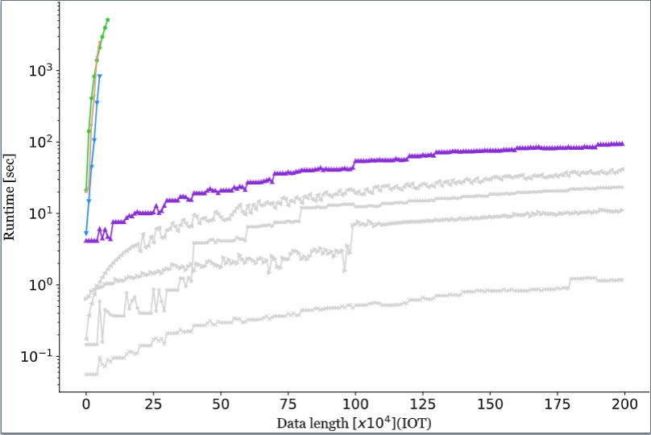
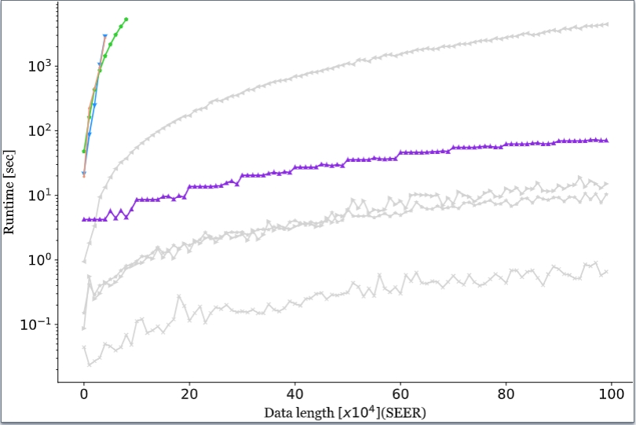
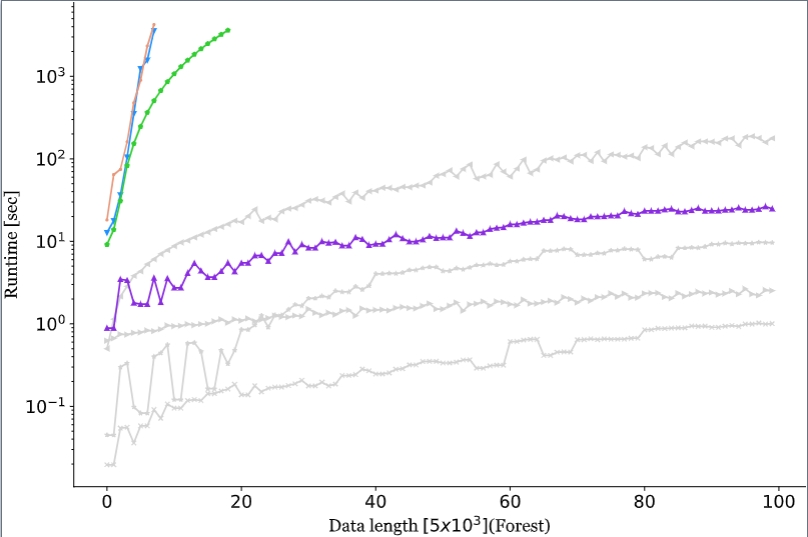
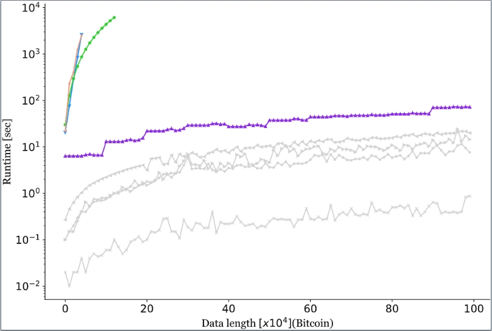
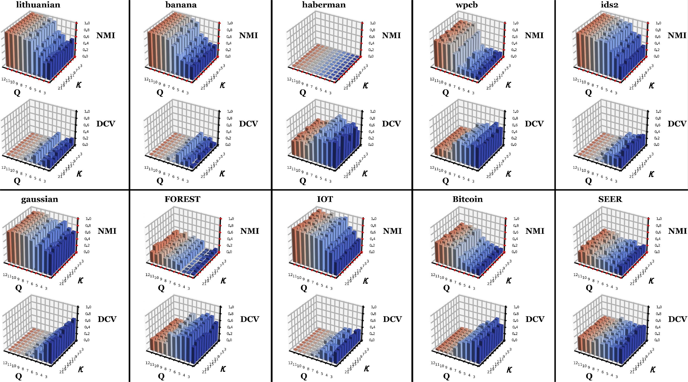

# Supplementary Material
## Section A: IDD-Gen Evaluation Augmentation

An IDD Generation (IDD-Gen) algorithm has been designed to generate streaming data chunks by performing two-layer randomization on cluster size and imbalance ratio based on given real datasets. The pseudocode for it is as follows：
IDD-Gen generates $N$ data chunks with imbalanced distributions over continuous time. Each chunk contains $n$ data samples with values from $d$ attributes. Chunk size $n$ depends on the scale of input data. The schematic diagram of data chunks is shown below：：

## Section B: Clustering performance Evaluation
We conducted a runtime-data size analysis on six large-scale datasets, the complete experimental results are as follows:

Please attention that we have represented the y-axis on a logarithmic scale due to the significant variation in running times among different methods.

## Section C: Parameter Analysis
In the proposed TSSC framework, there are two parameters, namely the number of neurons $Q^2$ and the neighbor count $\kappa$. Different values of these parameters can potentially affect the clustering performance in various ways. 
We conduct experiments on ten datasets by varying the values of $Q$ and $\kappa$, recording the obtained NMI and DCV. $Q$ values were traversed from 3 to 12 with a step size of 1, while $\kappa$ values ranged from 3 to 21 with a step size of 2, the complete experimental results are as follows:
