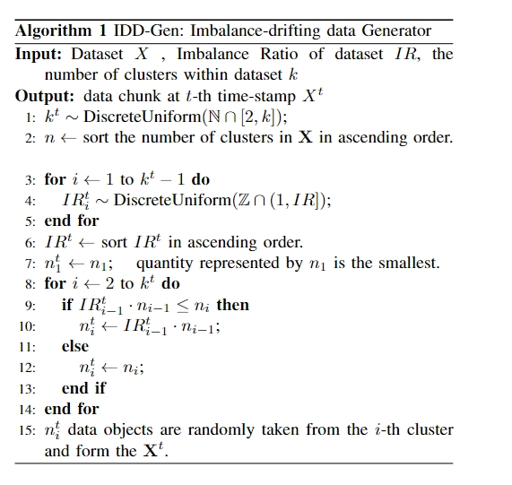

# Supplementary Material
## Section A: IDD-Gen Evaluation Augmentation

An IDD Generation (IDD-Gen) algorithm has been designed to generate streaming data chunks by performing two-layer randomization on cluster size and imbalance ratio based on given real datasets. The pseudocode for it is as follows：
