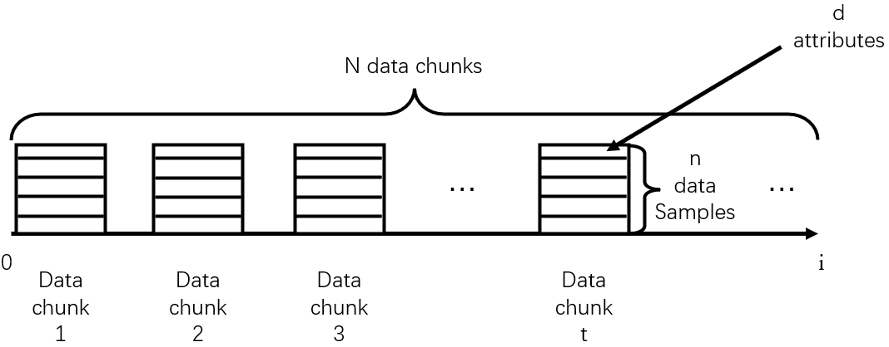

# Supplementary Material
## Section A: IDD-Gen Evaluation Augmentation

An IDD Generation (IDD-Gen) algorithm has been designed to generate streaming data chunks by performing two-layer randomization on cluster size and imbalance ratio based on given real datasets. The pseudocode for it is as follows：
IDD-Gen generates $N$ data chunks with imbalanced distributions over continuous time. Each chunk contains $n$ data samples with values from $d$ attributes. Chunk size $n$ depends on the scale of input data.The schematic diagram of data chunks is shown below：：
